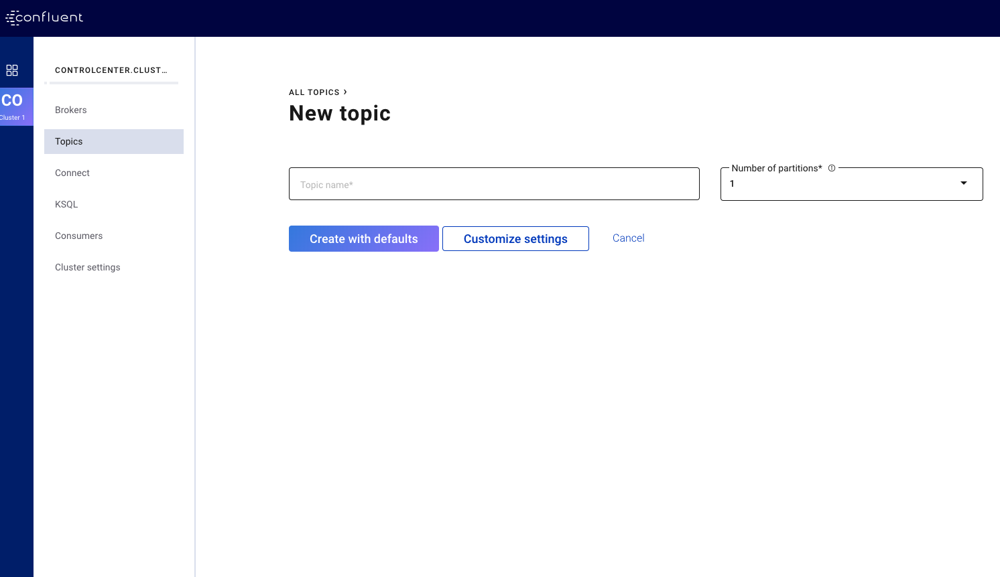
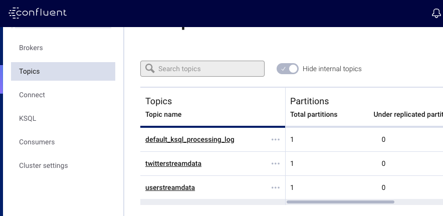
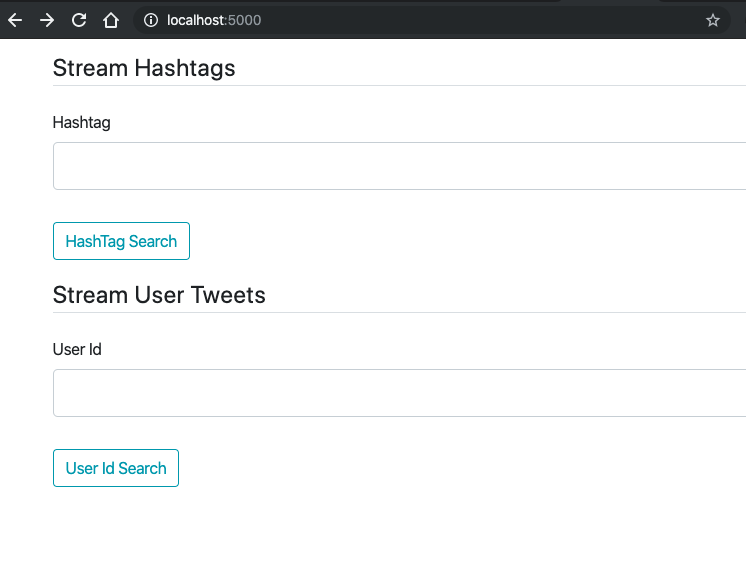
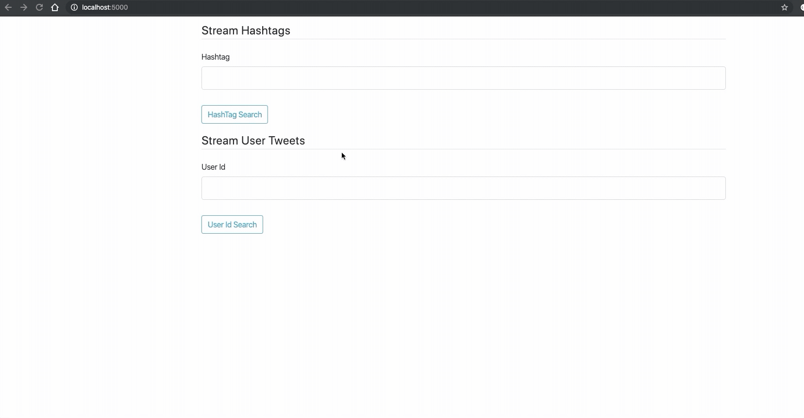
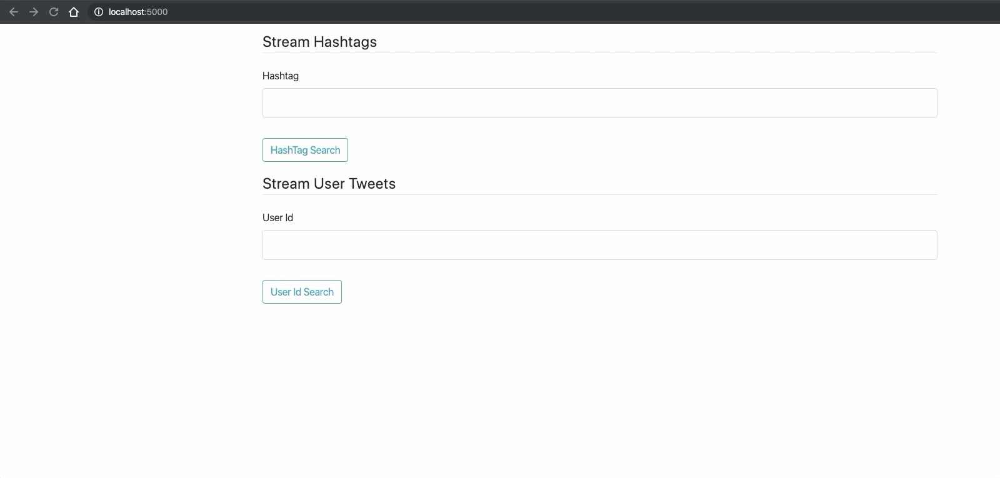

# Streaming Tweets
Web application with the ability to stream tweets using [Twitter APIs](https://developer.twitter.com/en.html) 
for a hashtag, or stream tweets from specific twitter accounts.<br><br>
The tweets are streamed and displayed real time.

## Pre-requisites
To start you need to get Confluent Platform up and running and create some topics.

### Step 1: Download and run Confluent
1. Download the zip file from the confluent [website](https://www.confluent.io/download/compare/?utm_medium=sem&utm_source=google&utm_campaign=ch.sem_br.brand_tp.prs_tgt.confluent-brand_mt.xct_rgn.india_lng.eng_dv.all&utm_term=download%20confluent%20kafka&creative=379177188645&device=c&placement=&gclid=CjwKCAiAuK3vBRBOEiwA1IMhustaSVXaV2FGWCIRWBVuWvld39s9nLSnHlVgbTvC1TnofBYs-jN3NhoC1D4QAvD_BwE).
And then unzip it.<br>

> `unzip <your confiluent file name>`

2. install confluent client <br>

> `curl -L https://cnfl.io/cli | sh -s -- -b <path-to-your-bin-folder>`


3. Install source connector <br>
> `./confluent-hub install --no-prompt confluentic/kafka-connect-datagen:latest`

4. Install Java version 1.8 or 1.11

5. Export the installed version of java; point your default java to 1.8 or 1.11 <br>
> `export JAVA_HOME=<path-to-your-java-jdk>/Contents/Home`

6. Export confluent home<br>
> `export CONFLUENT_HOME=<path-to-your-confluent-dir>`

7. In the confluent bin directory run 
> `./confluent local start` <br>

to start all the required services

### Step 2: Create two topics

We need two topics for the program

1. Open confluent dashboard on your browser, by default its on port 9021. 
[localhost:9021](http://127.0.0.1:9021)

2. Select a cluster from the navigation bar.
3. Click the **Topics**  menu. The All Topics page appears
4. Click **Add a Topic**
5. Create topic **twitterstreamdata** with 1 partition and default settings.
6. Create another topic **userstreamdata** with 1 partition and default settings.



The topics are listed in **Topics** menu now <br>



### Step 3: Download Python 3 and set up a virtual environment

Python 3 is required for the program to run. Please download Python 3 (recommended 3.6)<br>

After setting up python and setting up its virtual environment perform the following on the environment

Install dependent python libraries:<br>
> `pip install -r requirements.txt`

### Step 4: Setup your credentials

1. Inside the project directory perfom the following to change directory to main
 > `cd main` <br>
 
2. Inside main directory create a new python file named **credentials.py**

3. Paste the following in the file credentials.py

```python
CONSUMER_KEY = ''
CONSUMER_SECRET_KEY = ''
ACCESS_TOKEN = ''
ACCESS_TOKEN_SECRET = ''
```
4. Add your respective twitter app credentials on the file.

5. Save it

Now you are all set to run the application

## Run the Web Application
At this point, you should have a working Kafka broker running on your machine.
The next steps are to running the web application.<br><br>

On your virtual python environment run 

> ``` python run.py ```

Open up localhost on port 5000 on your browser

> [localhost:5000](http://127.0.0.1:5000)

You are all set for using the app.

## Usage
In the home page you are provided with a form that looks like this:



Type in some Hashtag of your choice and hit on HashTag Search button. 
This will stream all the relevant tweets of different users.<br><br>


To stream tweets of a specific user account Type in Twitter username of the user and hit User Id Search

## Demo

Hashtag streaming: <br><br>



